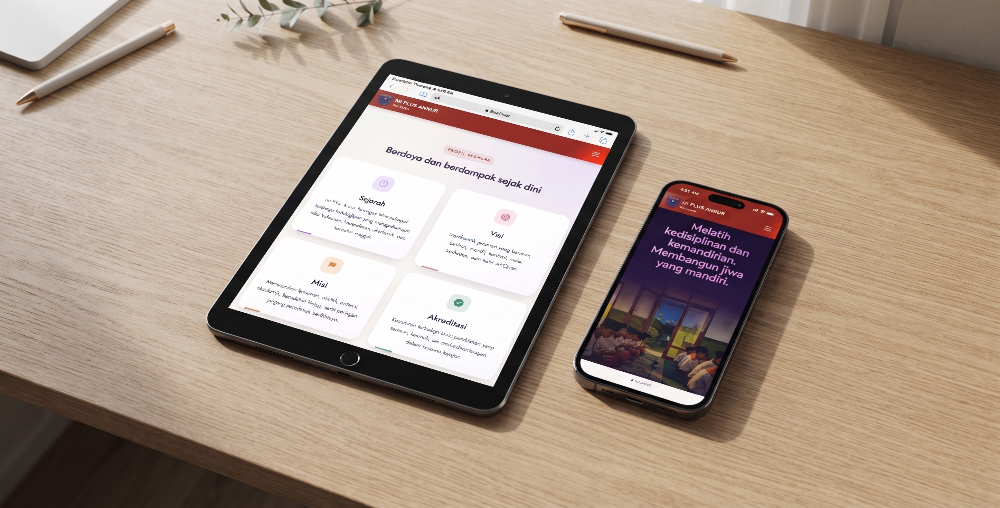
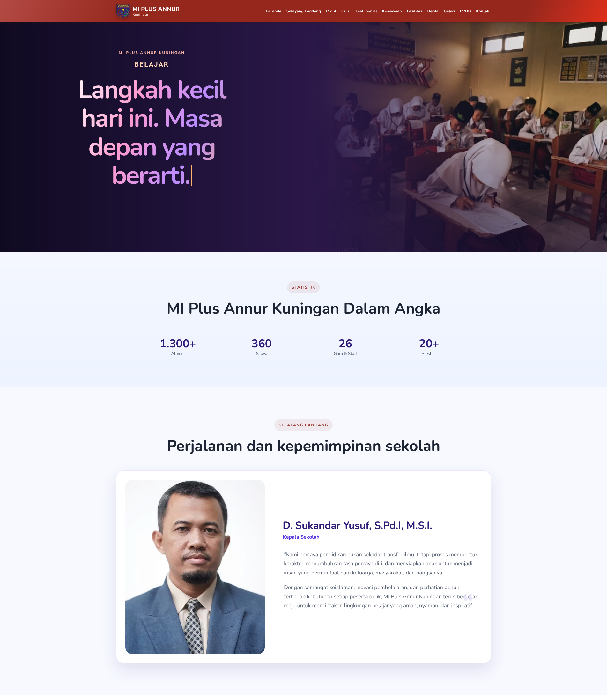
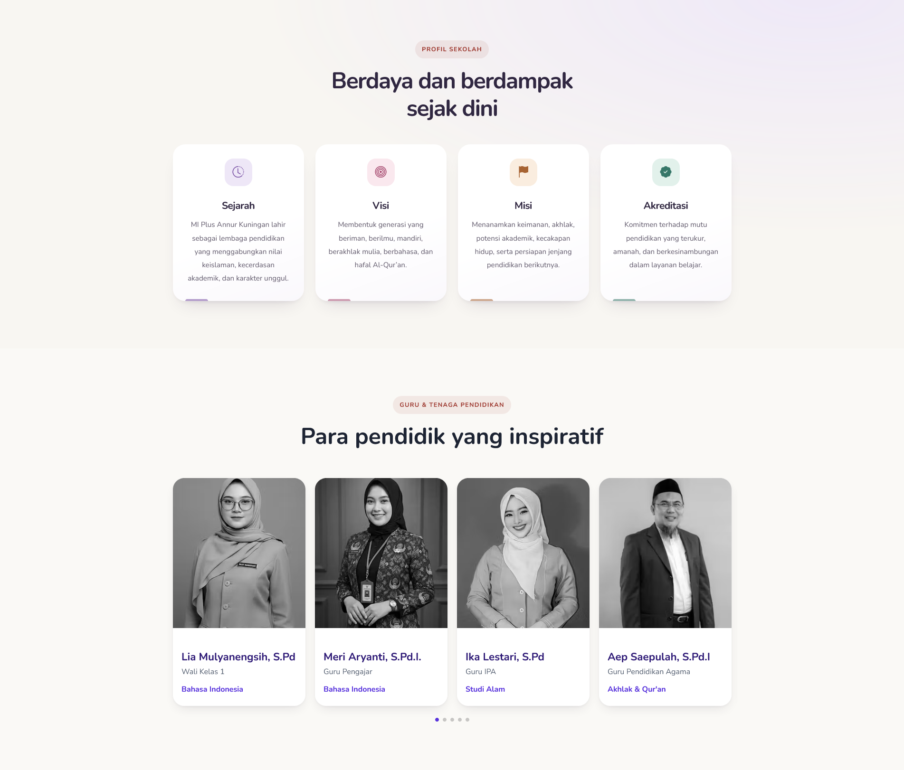
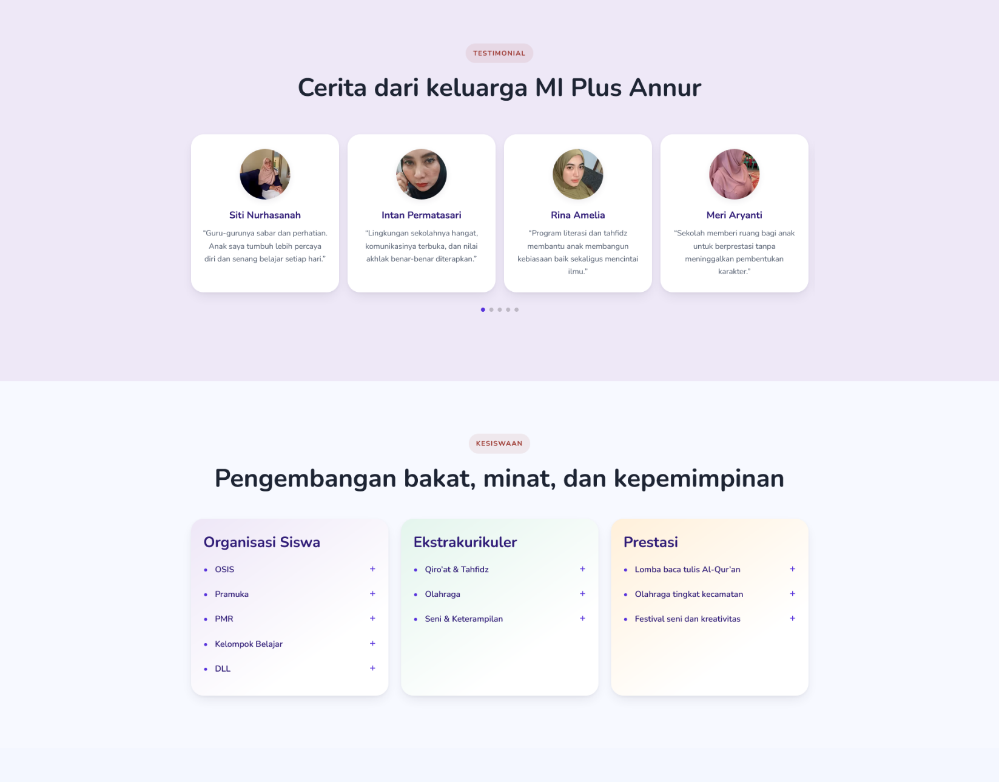
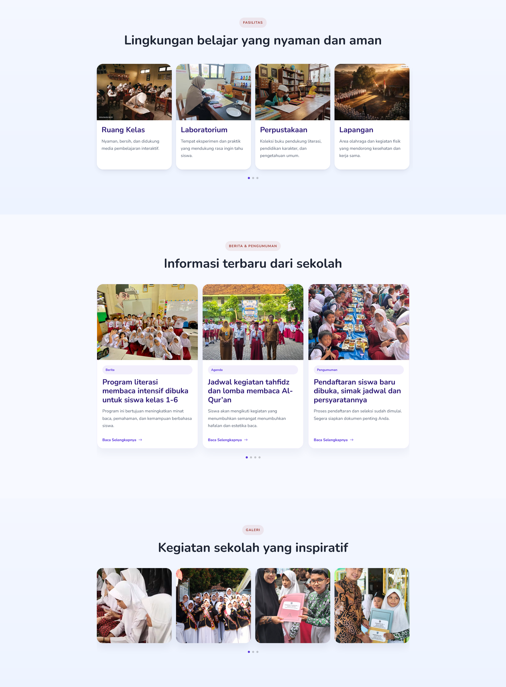
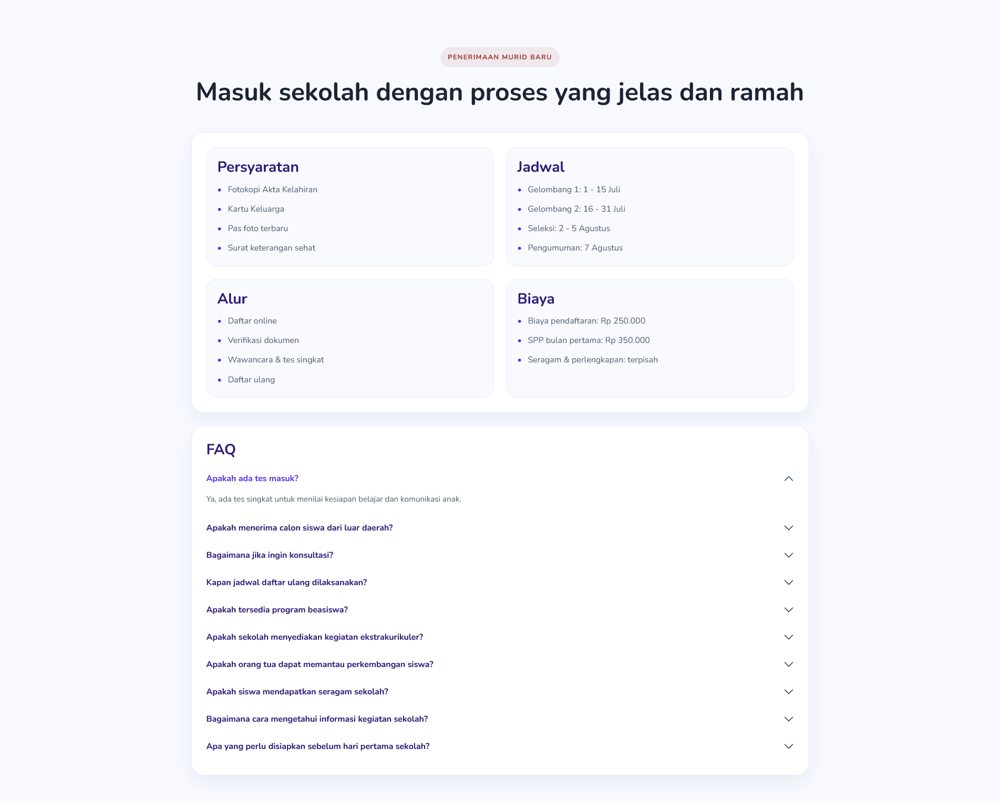
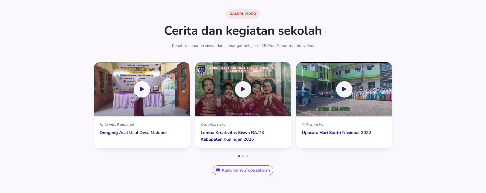
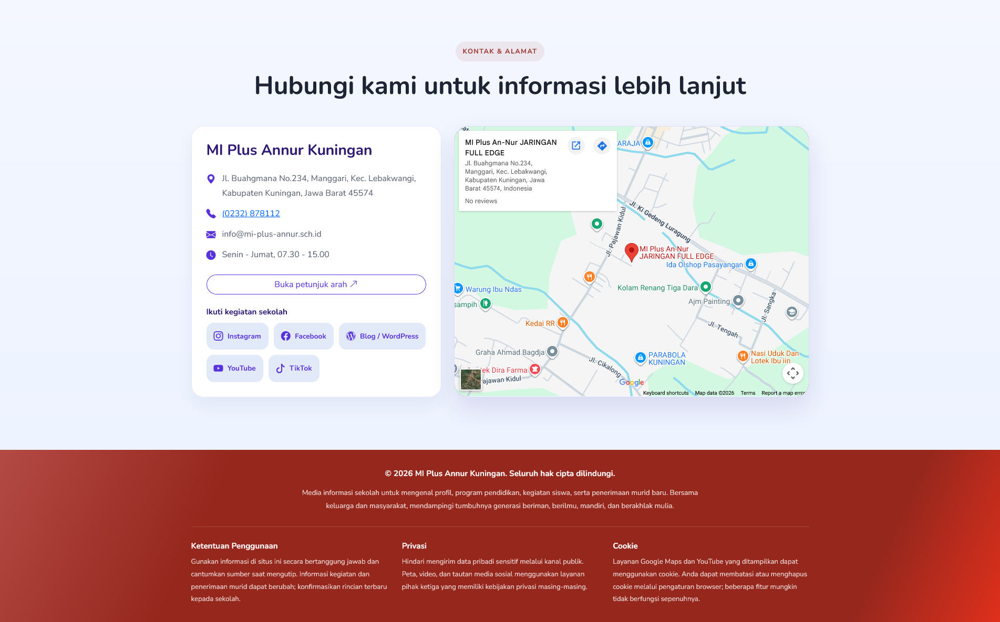

# Web Sekolah — MI Plus Annur Kuningan

**Profil sekolah, cerita siswa, dan informasi penerimaan murid dalam satu halaman.**

Template website sekolah responsif berbasis HTML, CSS, dan JavaScript, dengan tampilan MI Plus Annur Kuningan. Membantu orang tua mengenal sekolah melalui profil, tenaga pendidik, fasilitas, dokumentasi kegiatan, serta informasi pendaftaran.

Konten halaman profil dapat diedit langsung dari file proyek dan dijalankan tanpa database atau proses build. Inisialisasi kredensial API memerlukan PHP, ekstensi PDO MySQL, dan database MySQL.

[Lihat tampilan](#tangkapan-layar) · [Mulai menjalankan](#menjalankan-proyek) · [Kustomisasi](#kustomisasi) · [Panduan SEO](SEO.md)

## Konfigurasi, cache, dan routing PHP

Atur `_Config/config.php`:

- `base_url`: alamat instalasi, misalnya `http://localhost/web-sekolah`, `https://sekolah.sch.id`, atau `https://domain.sch.id/portal`. Tautan halaman dan aset mengikuti alamat ini. `.htaccess` mengambil prefix direktori dari permintaan sehingga tidak perlu mengubah `RewriteBase` saat pindah folder/domain.
- `mode_environment = DEVELOPMENT`: HTML dan aset lokal memakai `Cache-Control: no-store`; CSS/JavaScript juga diberi versi baru setiap render. Reload halaman untuk melihat perubahan.
- `mode_environment = PRODUCTION`: browser boleh menyimpan HTML dan aset lokal. `Cache-Control: public, no-cache` berarti cache disimpan tetapi divalidasi sebelum dipakai, bukan larangan menyimpan. ETag menghasilkan HTTP 304 jika isinya belum berubah. Versi URL aset mengikuti waktu perubahan file. Validasi ulang juga membuat pergantian ke development langsung terbaca.

Header aset lokal ditangani `_Helper/ServeAsset.php` melalui rewrite Apache, termasuk gambar dan font yang dimuat dari CSS. Kebijakan cache layanan eksternal (Google Fonts, gambar CDN, iframe) ditentukan layanan tersebut. `cache-mode.php` tetap tidak disimpan agar pemeriksaan environment oleh halaman HTML lama selalu terbaru.

| Halaman | URL utama PATH_INFO | Query kompatibilitas |
| --- | --- | --- |
| Beranda default | `index.php` | `index.php?route=` |
| Beranda eksplisit | `index.php/Beranda` | `index.php?route=Beranda` |
| Guru | `index.php/Guru` | `index.php?route=Guru` |
| Testimonial | `index.php/Testimonial` | `index.php?route=Testimonial` |

`PATH_INFO` didahulukan jika berisi nama halaman. Slash awal/akhir dibuang; route bertingkat seperti `index.php/Berita/Detail` dapat didaftarkan dengan key `Berita/Detail`. URL singkat satu segmen (`Guru`) dan tautan HTML lama tetap didukung Apache. PATH_INFO tidak memerlukan rewrite.

Untuk menambah halaman, buat file PHP konten lalu tambahkan satu entri pada `$routes` di `_Partial/RoutingPage.php`:

```php
'Kontak' => [
    'file' => '_Page/Kontak/Kontak.php',
    'title' => 'Kontak | MI Plus Annur Kuningan',
    'description' => 'Hubungi sekolah kami.',
    'class' => '',
],
```

Gunakan `$pageUrl('Kontak')` untuk tautan menu dan `$assetUrl('assets/css/style.css')` untuk aset. Menu ditambahkan sesuai kebutuhan di `_Partial/Navbar.php`.

`$pageFile` awalnya kosong. URL tanpa nama halaman memilih `$defaultPage` (Beranda); URL dengan nama halaman memilih entri `$routes`. Route tidak dikenal/file tidak tersedia menghasilkan 404, bukan fallback Beranda; parameter route array menghasilkan 400. Pemilihan route dan status HTTP selesai sebelum HTML dikirim. Konten Guru dan Testimonial masih memakai template yang tersedia, belum mengambil data database/API.

## Tampilan Web

[](assets/img/Mobile.jpeg)

*Klik gambar untuk melihat dalam ukuran penuh.*

## Fitur unggulan

### Header Interaktif, Statistik & Selayang Pandang

Navigasi memudahkan pengunjung berpindah antarbagian, sementara foto dan teks pada hero memperkenalkan suasana sekolah. Statistik merangkum jumlah alumni, siswa, guru, dan prestasi, dilengkapi sambutan kepala sekolah untuk mengenalkan arah pendidikan MI Plus Annur.

[](assets/img/Screenshot-Header.png)

### Profil Sekolah & Guru

Kartu profil menyajikan sejarah, visi, misi, dan akreditasi dengan ikon serta warna pastel. Daftar guru ditampilkan dalam slider responsif yang memuat foto, nama, jabatan, dan bidang pengajaran. Foto hitam putih berubah menjadi warna asli saat diarahkan kursor atau diklik.

[](assets/img/Screenshot-Statistik-Guru.png)

### Testimoni & Kesiswaan

Testimoni menampilkan pengalaman keluarga siswa dalam kartu yang dapat digeser. Bagian Kesiswaan merangkum organisasi siswa, ekstrakurikuler, dan prestasi melalui daftar yang dapat dibuka untuk membaca keterangannya, dengan gradasi lembut yang membedakan setiap kategori.

[](assets/img/Screenshot-Testimoni-Kesiswaan.png)

### Fasilitas, Berita & Galeri Foto

Kartu fasilitas memperkenalkan sarana belajar melalui foto dan deskripsi singkat. Berita dan pengumuman menyediakan tautan Baca Selengkapnya menuju halaman contoh artikel. Galeri foto melengkapi dokumentasi kegiatan dengan gambar yang dapat digeser dan diperbesar dalam popup.

[](assets/img/Screenshot-Fasilitas-Berita-Galeri.png)

### Penerimaan Murid Baru & FAQ

Informasi penerimaan murid disusun dalam bagian persyaratan, jadwal, alur, dan biaya agar mudah dipahami orang tua. FAQ menyediakan jawaban atas pertanyaan umum dengan daftar buka-tutup yang menyatu dengan kartu utama.

[](assets/img/Screenshot-Penerimaan-Murid-Baru.png)

### Galeri Video & Kanal YouTube

Dokumentasi video ditampilkan dalam slider berisi thumbnail, judul, dan tombol putar. Pengunjung dapat menonton melalui popup atau membuka kanal YouTube sekolah untuk melihat cerita dan kegiatan lainnya.

[](assets/img/Screenshot-Galeri-Vidio.png)

### Kontak, Peta Lokasi & Footer

Bagian kontak memuat alamat, telepon, email, jam layanan, dan tautan media sosial sekolah. Peta serta tombol petunjuk arah membantu pengunjung menemukan lokasi, sementara footer merangkum identitas sekolah, ketentuan penggunaan, privasi, dan cookie dengan gradasi merah yang senada dengan header.

[](assets/img/Screenshot-Kontak-Footer.png)

## Isi halaman

| Bagian | Isi |
| --- | --- |
| Beranda | Hero foto dan subtitle bergantian |
| Statistik | Angka sekolah dengan animasi penghitung |
| Selayang Pandang | Sambutan dan profil kepala sekolah |
| Profil Sekolah | Sejarah, visi, misi, dan akreditasi |
| Guru & Testimonial | Tenaga pendidik dan cerita keluarga sekolah |
| Kesiswaan | Kegiatan dan pengembangan siswa |
| Fasilitas & Berita | Sarana sekolah serta kabar kegiatan |
| Galeri Foto | Dokumentasi dengan pratinjau gambar |
| Penerimaan Murid Baru | Informasi pendaftaran dan pertanyaan umum |
| Galeri Video | Lima video YouTube dalam slider |
| Kontak & Alamat | Peta, Instagram, Facebook, WordPress, YouTube, dan TikTok |
| Footer | Copyright, ketentuan penggunaan, privasi, dan cookie |

## Teknologi

| Teknologi | Penggunaan |
| --- | --- |
| HTML5 & CSS3 | Konten, tema, dan tata letak responsif |
| JavaScript | Interaksi halaman tanpa framework |
| Bootstrap 5 | Grid, navigasi offcanvas, accordion, dan modal |
| Bootstrap Icons | Ikon antarmuka dan media sosial |
| Swiper | Slider foto dan kartu |
| npm | Instalasi dependensi frontend |

YouTube digunakan untuk video, Google Maps untuk peta, serta Imgix dan Unsplash untuk sebagian gambar. Font menggunakan kombinasi aset lokal dan Google Fonts. Layanan eksternal tersebut memerlukan koneksi internet.

`package.json` juga masih mencantumkan jQuery dan MDB UI Kit, tetapi keduanya tidak dimuat oleh `index.html` saat ini.

## Menjalankan proyek

### 1. Ambil kode dan instal dependensi

Siapkan Git, Node.js, dan npm, lalu jalankan:

```bash
git clone https://github.com/solihulhadi141213/web-sekolah.git
cd web-sekolah
npm ci
```

`npm ci` memasang dependensi sesuai `package-lock.json`. Halaman mengambil CSS dan JavaScript pustaka langsung dari `node_modules`, sehingga langkah ini diperlukan.

### 2. Jalankan melalui server lokal

**WAMP / XAMPP**

Letakkan folder proyek di direktori web server, misalnya:

```text
WAMP   : C:\wamp64\www\web-sekolah
XAMPP  : C:\xampp\htdocs\web-sekolah
```

Aktifkan Apache, lalu buka <http://localhost/web-sekolah/>.

**Alternatif dengan Python 3**

Dari direktori proyek:

```bash
python -m http.server 8000
```

Buka <http://localhost:8000>. Server ini cukup untuk pratinjau halaman, tetapi tidak menerapkan konfigurasi Apache dalam `.htaccess`.

## Struktur proyek

```text
web-sekolah/
├── index.html               # Seluruh konten halaman
├── assets/
│   ├── css/style.css        # Tema dan tata letak
│   ├── js/main.js           # Slider, modal, dan interaksi
│   ├── fonts/               # Font lokal dan site-fonts.css
│   └── img/
│       ├── Screenshot.png   # Pratinjau website di README
│       └── favicon/         # Ikon situs
├── node_modules/            # Dibuat oleh npm ci; tidak disimpan di Git
├── package.json
├── package-lock.json
├── robots.txt               # Aturan crawling
├── .htaccess                # Kompresi dan cache Apache
├── SEO.md                   # Catatan SEO dan publikasi
└── LICENSE                  # Apache License 2.0
```

## Konfigurasi koneksi dan kredensial

Setelah mengunduh atau melakukan clone proyek, buat direktori `_Config` di akar proyek, lalu buat file `_Config/config.php` secara manual. File ini diabaikan oleh Git karena menyimpan parameter koneksi dan kredensial, sehingga tidak disertakan dalam repositori.

Isi file tersebut dengan konfigurasi PHP yang dibutuhkan oleh kode koneksi aplikasi, seperti host database, nama database, nama pengguna, dan kata sandi. Sesuaikan nama variabel atau struktur konfigurasi dengan kode yang membacanya. Gunakan kredensial milik lingkungan masing-masing dan jangan memasukkannya ke README atau commit.

Untuk deployment, buat file ini langsung di server melalui akses privat. `.gitignore` hanya mencegah file baru dilacak Git; aturan ini tidak membatasi akses HTTP pada server.

### Parameter JWT

Tambahkan `jwt_secret_key` dan `jwt_issuer` ke array yang dikembalikan oleh `_Config/config.php`, dengan tetap mempertahankan parameter database dan konfigurasi lainnya.

- `jwt_secret_key`: kunci rahasia untuk penandatanganan dan verifikasi JWT. Buat nilai acak tersendiri untuk setiap lingkungan, simpan hanya di server, dan jangan gunakan API secret klien sebagai penggantinya.
- `jwt_issuer`: identitas penerbit token (claim `iss`), misalnya `https://sekolah.example`. Sesuaikan dengan identitas layanan Anda dan gunakan nilai yang konsisten pada penerbit serta pemeriksa token.

Untuk membuat kunci acak, jalankan perintah berikut di terminal yang menyediakan PHP, lalu salin hasilnya sebagai nilai `jwt_secret_key` pada konfigurasi lokal:

```bash
php -r "echo bin2hex(random_bytes(32)), PHP_EOL;"
```

Buat kunci sekali saat menyiapkan lingkungan dan simpan nilainya; jangan membuat ulang pada setiap request. Mengganti kunci menyebabkan token yang ditandatangani dengan kunci lama gagal diverifikasi oleh kunci baru.

### Membuat kredensial API awal

Skrip [generate_api_key.php](generate_api_key.php) membuat record awal pada tabel `api_credentials` yang strukturnya tersedia di [DB/web_sekolah.sql](DB/web_sekolah.sql).

1. Aktifkan Apache dan MySQL pada WAMP/XAMPP, serta pastikan PHP memiliki ekstensi `pdo_mysql`. Server statis Python tidak dapat menjalankan skrip PHP ini.
2. Siapkan database baru, lalu impor `DB/web_sekolah.sql` ke database tersebut melalui phpMyAdmin atau klien MySQL. **Berkas SQL berisi `DROP TABLE IF EXISTS`; jangan mengimpornya ulang ke database berisi data yang ingin dipertahankan.**
3. Buat `_Config/config.php` seperti petunjuk di atas. File harus mengembalikan array PHP dengan kunci `db_host`, `db_name`, `db_user`, dan `db_pass` untuk koneksi database. Sertakan juga `jwt_secret_key` dan `jwt_issuer` untuk konfigurasi JWT aplikasi. Contoh berikut hanya menggunakan placeholder; ganti nilainya sesuai lingkungan Anda dan pertahankan konfigurasi lain yang sudah ada:

   ```php
   <?php
   // Parameter koneksi lokal; isi dengan kredensial lingkungan masing-masing.
   return [
       'db_host' => 'localhost',
       'db_name' => 'nama_database_anda',
       'db_user' => 'pengguna_database_anda',
       'db_pass' => 'kata_sandi_database_anda',
       // Parameter JWT; ganti placeholder dengan nilai lingkungan Anda.
       'jwt_secret_key' => 'ganti_dengan_hasil_random_bytes_di_atas',
       'jwt_issuer' => 'https://sekolah.example',
   ];
   ```

4. Jalankan skrip melalui browser lokal dengan membuka `http://localhost/web-sekolah/generate_api_key.php` (sesuaikan nama folder proyek). Jalankan satu kali, tanpa membuka beberapa permintaan bersamaan.
5. Setelah berhasil, segera salin API key dan API secret ke penyimpanan rahasia aplikasi klien. Hasil skrip menunjukkan nama header `x-api-key` dan `x-api-secret`. **API secret asli hanya ditampilkan saat pembuatan**; database menyimpan hash dari `password_hash(..., PASSWORD_DEFAULT)`, sehingga secret asli tidak dapat dibaca kembali dari database. Jangan menyimpan hasilnya dalam Git atau JavaScript publik.
6. Setelah selesai, hapus skrip dari server deployment atau blokir akses publik ke URL tersebut. Skrip belum menyediakan autentikasi admin; pemeriksaan adanya kredensial aktif tidak menggantikan pembatasan akses.

Record yang dibuat menggunakan nama aplikasi `Aplikasi Eksternal Default`, `is_active = 1`, dan permissions `read_articles`, `read_settings`, serta `write_gallery`. Jika diperlukan, sesuaikan `$app_name` dan `$permissions` di skrip sebelum menjalankannya.

**Jika muncul ?Kredensial Sudah Ada?:** skrip menolak pembuatan ketika ada setidaknya satu record dengan `is_active = 1`. Gunakan kredensial yang sudah disimpan. Jika memang perlu mengganti kredensial, admin dapat menonaktifkan record lama (`is_active = 0`) melalui pengelolaan database, lalu menjalankan skrip kembali dan memperbarui konfigurasi klien. Penonaktifan akan mencabut akses klien yang memakai kredensial lama jika API memeriksa status aktif.

## Kustomisasi

| Ingin mengubah… | Edit di… |
| --- | --- |
| Nama sekolah, teks, guru, kegiatan, dan kontak | [index.html](index.html) |
| Warna, tipografi, kartu, dan ukuran tampilan | [assets/css/style.css](assets/css/style.css), mulai dari variabel `:root` |
| Kecepatan slider, animasi, dan perilaku popup | [assets/js/main.js](assets/js/main.js) |
| Logo dan favicon | [assets/img/favicon/](assets/img/favicon/) beserta referensinya di HTML |
| Judul pencarian dan deskripsi berbagi | Elemen `<head>` di `index.html` |
| Identitas sekolah untuk mesin pencari | Blok JSON-LD `School` di `index.html` |

### Mengganti video YouTube

Cari bagian `id="videos"` di `index.html`. Setiap kartu memiliki tautan YouTube, atribut `data-youtube-id`, thumbnail, keterangan, dan judul.

Untuk URL `https://www.youtube.com/watch?v=dpvPcsMVbWA`, ID videonya adalah `dpvPcsMVbWA`. Sesuaikan ID pada ketiga atribut berikut:

- `href="https://www.youtube.com/watch?v=..."`
- `data-youtube-id="..."`
- `src="https://i.ytimg.com/vi/.../hqdefault.jpg"`

Perbarui juga judul, keterangan, dan `aria-label` tombol. Untuk menambah video, salin satu blok `.swiper-slide` di dalam `.videoSwiper`.

### Mengganti gambar

Sesuaikan `src` dan deskripsi `alt`. Pada gambar responsif, perbarui juga `srcset`, `sizes`, serta `data-full-src` yang dipakai untuk pratinjau ukuran penuh. Pertahankan `loading="lazy"` untuk gambar di luar hero pertama.

## Performa dan aksesibilitas

- Gambar Imgix tersedia dalam beberapa ukuran agar browser dapat memilih sumber yang sesuai.
- Gambar hero pertama diprioritaskan; gambar lain dan peta memakai *lazy loading*.
- Pemutar YouTube baru dibuat setelah tombol play ditekan dan dihentikan ketika popup ditutup.
- Skrip memakai `defer`, dan CSS font lokal dibatasi pada keluarga font yang digunakan.
- Tersedia tautan lewati navigasi, indikator fokus, label tombol, serta dukungan preferensi pengurangan gerakan.
- Konten utama tersedia dalam HTML; JavaScript menambahkan interaktivitas.

## Publikasi dan SEO

Situs dapat dipasang pada hosting yang melayani file statis. Tidak ada perintah build khusus. Unggah `index.html`, `assets`, `robots.txt`, dan dependensi yang dirujuk dari `node_modules`. Sertakan `.htaccess` bila menggunakan Apache.

**Jangan hanya mengunggah file yang dilacak Git:** `node_modules` diabaikan oleh `.gitignore`. Jalankan `npm ci` sebelum menyiapkan berkas publikasi, atau sertakan langkah instalasi dalam proses deployment.

Sebelum dipublikasikan:

1. Sesuaikan data sekolah, materi gambar/video, kontak, dan redaksi footer.
2. Gunakan domain HTTPS yang benar untuk canonical, metadata URL, dan sitemap. Bagian ini masih menunggu domain produksi.
3. Pastikan `robots.txt` tersedia di akar domain dan aset CSS/JS dapat diakses.
4. Periksa kompresi dan cache pada hosting; aturan `.htaccess` bergantung pada dukungan modul Apache.
5. Uji tampilan ponsel, tautan, pemutar video, serta kecepatan halaman pada hosting tujuan.

Lihat [SEO.md](SEO.md) untuk rincian konfigurasi, pengujian lokal, dan langkah pengindeksan. Skor performa produksi dan status indeks Google belum diukur.

## Kontribusi

Masukan desain, laporan bug, dan perbaikan dokumentasi dipersilakan melalui issue atau pull request. Untuk laporan tampilan, sertakan ukuran layar, browser, langkah reproduksi, dan tangkapan layar bila memungkinkan.

## Lisensi

Kode proyek menggunakan [Apache License 2.0](LICENSE). Lisensi dan izin penggunaan foto, video, logo, serta font mengikuti ketentuan pemilik masing-masing.
